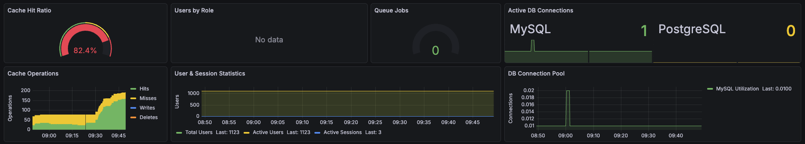

# Laravel Prometheus Metrics

[](https://github.com/Faktly-GmbH/laravel-prometheus-metrics/actions?query=workflow:Tests)
[](https://github.com/Faktly-GmbH/laravel-prometheus-metrics/releases)

[](LICENSE.md)
[](https://github.com/Faktly-GmbH/laravel-prometheus-metrics/graphs/contributors)
[](https://packagist.org/packages/faktly/laravel-prometheus-metrics)
[](https://packagist.org/packages/faktly/laravel-prometheus-metrics)

---

**Stop guessing. Start measuring.** Expose production-grade Laravel metrics as JSON/YAML/Prometheus so Prometheus, Grafana, and any monitoring stack can tell you what is really happening inside your app.

If you have ever asked, “Why is the API slow?” or “Are queue jobs backing up?” or “Did deploy X increase errors?”, this package helps you answer in minutes, not hours.

<p align="center">
  
</p>

---

## Why this exists

Most Laravel apps only become “observable” after something breaks.

This exporter gives you fast visibility into the stuff that actually moves the needle:
- Performance bottlenecks.
- Queue pressure.
- Cache behavior.
- Error patterns.
- Auth and session activity.

---

## What you get

✨ **10+ Metric Collectors**: Database, Sessions, Queue, Mail, Cache, Users, 
Event Sourcing, Permissions, Horizon, Meilisearch.

🔌 **Fully optional**: Enable what you need, disable what you do not.

🚀 **High performance**: Built-in caching with configurable TTL.

🔒 **Secure by default**: Token-protected endpoint.

📦 **Modern stack**: Laravel 11+, PHP 8.2+.

📊 **JSON export**: Prometheus-friendly, Grafana-friendly, also easy to consume 
for custom tooling.

---

## Quick Start

### Installation

```bash
composer require faktly/laravel-prometheus-metrics
php artisan vendor:publish --provider="Faktly\LaravelPrometheusMetrics\LaravelPrometheusMetricsServiceProvider"
```

#### Count user session with prometheus_metrics_user_sessions table

If you use non-database session drivers, “active sessions” can be hard to 
measure reliably.

This package includes a database table plus middleware, so you can still count 
user sessions regardless of your session driver.

If you use UUID or ULID primary keys, adjust the published migration before 
applying it.

### Configure

```env
PROMETHEUS_METRICS_TOKEN=your-secret-token-here
```

#### Configure Prometheus scrape config

Add this to `/etc/prometheus/prometheus.yml` :

```
- job_name: "laravel"
  scheme: https
  metrics_path: /internal/metrics
  http_headers:
    X-Metrics-Token:
      values: ["YOUR_TOKEN"]
  static_configs:
    - targets: ["YOUR_HOST:443"]
```

Replace YOUR_TOKEN and YOUR_HOST.

You can create a safe token with ``openssl rand -hex 64`` and **YOUR_HOST** could be
a local **IP:PORT** combination or your website **HOST:PORT**.

### Verify it works

```bash
curl -H "X-Metrics-Token: your-secret-token-here" \
  http://localhost/internal/metrics
```

#### Register Middleware for HTTP metrics

In legacy apps or custom middleware setups, register the HTTP metrics middleware
early (but after session start).

Add this to Kernel.php, or in newer Laravel versions bootstrap/app.php:

```php
->withMiddleware(function (Middleware $middleware) {
    // Global HTTP Middleware - runs for every request
    $middleware->use([
        \Faktly\LaravelPrometheusMetrics\Http\Middleware\RecordHttpMetricsMiddleware::class,
        \Faktly\LaravelPrometheusMetrics\Http\Middleware\TrackPrometheusUserSession::class,
    ]);
     // Middleware Priority
    $middleware->priority([
        \Illuminate\Cookie\Middleware\EncryptCookies::class,
        \Illuminate\Cookie\Middleware\AddQueuedCookiesToResponse::class,
        \Illuminate\Session\Middleware\StartSession::class,
        \Faktly\LaravelPrometheusMetrics\Http\Middleware\RecordHttpMetricsMiddleware::class,
        \Faktly\LaravelPrometheusMetrics\Http\Middleware\TrackPrometheusUserSession::class,
    ]);
```

### Test Locally

```bash
php artisan prometheus:test-metrics
```

## What Gets Measured

| Collector          | Metrics                            | Optional | Requires         |
|--------------------|------------------------------------|----------|------------------|
| **Database**       | Active connections, queries        | ✅        | Laravel DB       |
| **Sessions**       | Active count, driver info          | ✅        | Laravel Sessions |
| **Queue**          | Pending/failed jobs, per-queue     | ✅        | Laravel Queue    |
| **Mail**           | Sent/failed count                  | ✅        | Laravel Mail     |
| **Cache**          | Driver info, hits/misses           | ✅        | Laravel Cache    |
| **Users**          | Total count, active, per-role      | ✅        | Laravel Auth     |
| **Event Sourcing** | Events total, aggregates, per-type | ✅        | Spatie           |
| **Permissions**    | Roles, permissions, users per role | ✅        | Spatie           |
| **Horizon**        | Jobs per minute, processes         | ✅        | Laravel          |
| **Meilisearch**    | Health, indexes, documents         | ✅        | Meilisearch      |

## License

MIT License. See [LICENSE.md](LICENSE.md) for details.
